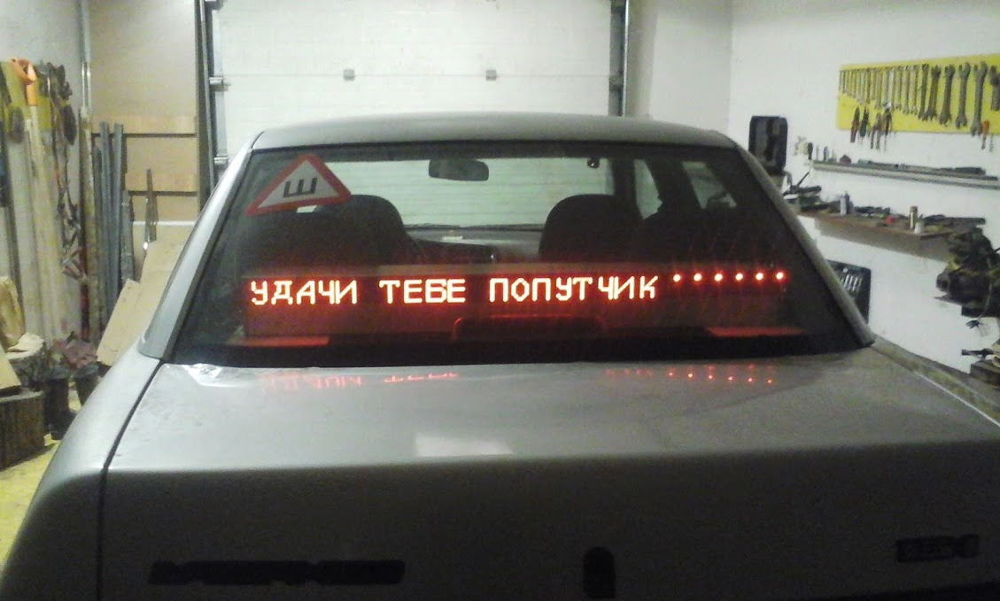
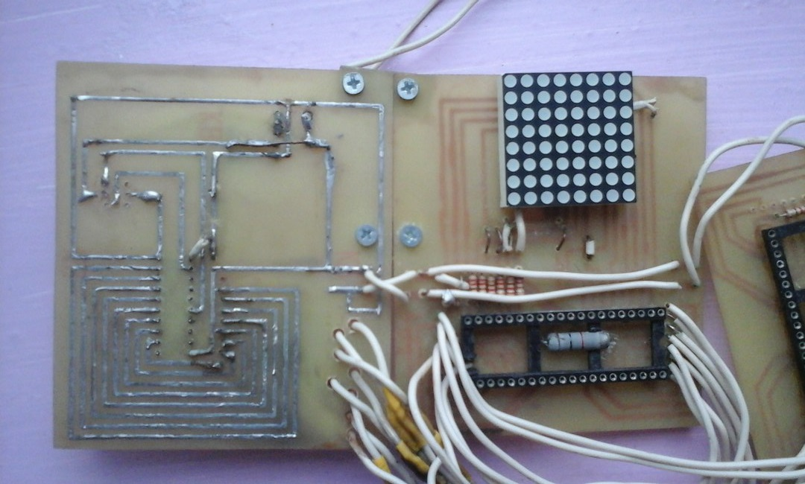

# Led-panel
Репозиторий содержит 3 asm файла с ассемблерным кодом для микроконтроллеров ATtiny2313, ATmega32, которые управляют светодиодными матрицами 8x8 в самодельной автомобильной панели. ATtiny2313 получает код клавиши клавиатуры, установленной в салоне автомобиля. 
Далее код переходит по проводам на миктоконтроллеры ATmega32, которые вырисовывают буквы одну за другой.

This repository contains 3 asm files with the firmware code of ATtiny2313, ATmega32 microcontrollers, which are installed in a homemade car led panel. The keyboard is installed in the car. The text is displayed character by character.
Operation of the microcontroller with the code "working UART.asm" is the reception of the data from the keypad to the microcontroller and transfer it to Atmega 32 " firstLetter.asm"
Operation of the microcontroller with the code " first Letter.asm" is the reception of the data from the "working UART.asm", the display on a led matrix 8x8 and transfer bytes for Atmega32 code " nextLetter.asm"
Operation of the microcontroller with the code " nextLetter.asm" is the reception of the data from the "first Letter.asp", display on 8x8 led matrix and transfer to the following microcontrollers.

